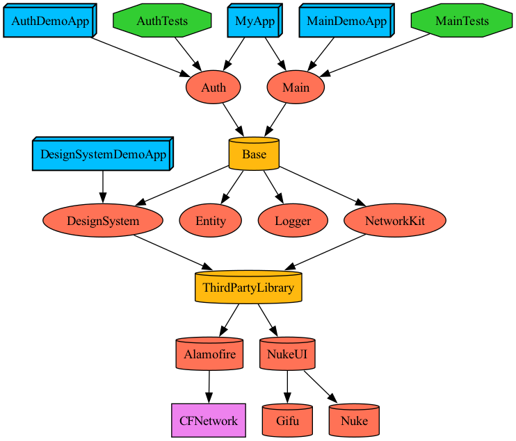

## Tuist
> 4.22.0

 <br/>

&emsp;**1.** [Tuist 설치하기](https://tuist.io/)

&emsp;**2.** Dependecy 가져오기
```sh
tuist install
```

&emsp;**3.** XCConfig 설정하기
```sh
mkdir -p XCConfig && echo '#include "./Shared.xcconfig"' >> XCConfig/Debug.xcconfig && echo '#include "./Shared.xcconfig"' >> XCConfig/Release.xcconfig && echo '// Shared' >> XCConfig/Shared.xcconfig
```

&emsp;**4.** 프로젝트 생성하기
```sh
tuist generate
```

&emsp;**5.** Feature 생성하기
```sh
tuist scaffold feature --name Auth
```

&emsp;**6.** Core 생성하기
```sh
tuist scaffold core --name Utility
```

<br/>
<br/>

## :white_check_mark: Dependency Graph
> 의존성 그래프
<br/>

- 그래프 생성하기
```sh
tuist graph
tuist graph -t # 테스트 타겟 제외
tuist graph -d # 외부 라이브러리 제외
```


<br/>
