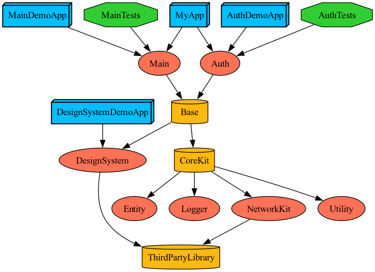

## Tuist
```sh
tuist graph
tuist graph -t # 테스트 타겟 제외
tuist graph -d # 외부 라이브러리 제외
```


<br/>

&emsp;**1. [Tuist 설치하기](https://tuist.io/)**
<br/>

&emsp;**2. Dependecy 가져오기**
```sh
tuist install
```

&emsp;**3. XCConfig 설정하기**
```sh
mkdir -p XCConfig && echo '#include "./Shared.xcconfig"' >> XCConfig/Debug.xcconfig && echo '#include "./Shared.xcconfig"' >> XCConfig/Release.xcconfig && echo '// Shared' >> XCConfig/Shared.xcconfig
```

&emsp;**4. 프로젝트 생성하기**
```sh
tuist generate
```

&emsp;**5. Feature 생성하기**
```sh
tuist scaffold feature --name Auth
tuist edit
```
&emsp;- module.swift 에 feature 정의하기

```
// module.swift

// MARK: Feature
public extension Module {
    enum Feature: String, CaseIterable {
        case Auth
        case Main
        case Base
        
        public static let name: String = "Feature"
    }
}
```

&emsp;**6. Core 생성하기**
```sh
tuist scaffold core --name Utility
```

&emsp;- module.swift 에 core 정의하기

```
// module.swift

// MARK: Core
public extension Module {
    enum Core: String, CaseIterable {
        case Entity
        case NetworkKit
        case ThirdPartyLibrary
        case Logger
        case Utility
        
        public static let name: String = "Core"
    }
}
```

<br/>

